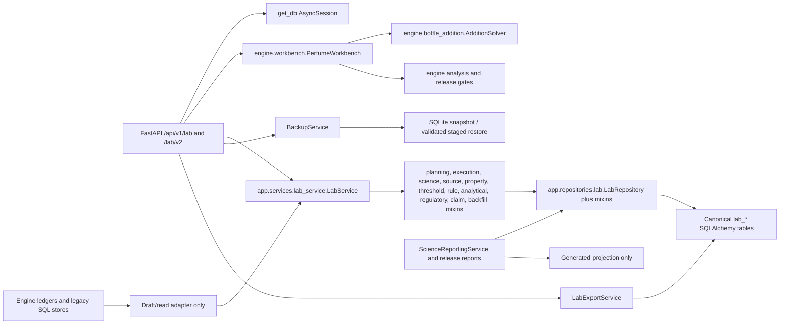
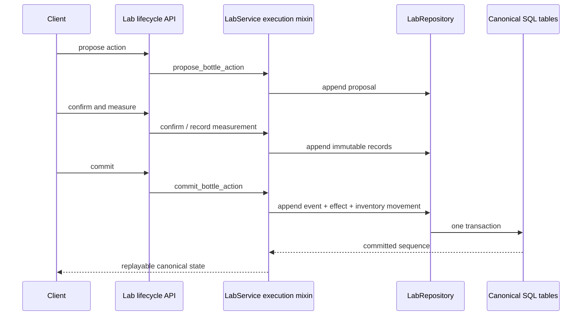

# A0 import, call, and persistence graph

This graph is based on static search, runtime imports, 62 resolved lab routes, 97 loaded SQLAlchemy tables, zero legacy-write scanner violations, the 629-test backend run, and a focused 35-test persistence/backup/export run.

## Runtime graph

Analysis endpoints can call `PerfumeWorkbench` directly because it is deterministic computation. A physical or canonical write cannot end at the workbench; it must be converted into a command and committed through `LabService`.

## API to service map

| API surface | Primary call | Persistence |
|---|---|---|
| `/lab/v2/targets`, accepted target, formula parents | `LabPlanningServiceMixin` through `LabService` | target, accepted-target, formula-edge tables |
| `/lab/v2/inventory-mappings`, build plans, reservations | planning mixin | mapping, build-plan, reservation-event, movement tables |
| `/lab/v2/actions` propose/confirm/measure/commit | execution mixin | action proposal/confirmation/commit, bottle events/effects, movements |
| `/lab/v2/analytical-results`, sensory results, regulatory assessment, release review | science/lifecycle service methods | analytical, sensory, regulatory, claim records |
| `/lab/materials`, stocks, bottles, formulas, experiments | base `LabService` | core lab tables |
| `/lab/analysis`, interventions, trial plan | `PerfumeWorkbench` | none until an explicit service command is accepted |
| `/lab/export`, `/lab/import` | `LabExportService` | versioned export projection or validated transactional import |
| `/lab/backups`, validate, stage restore | `BackupService` | SQLite snapshot/staged file; no implicit live overwrite |
| `/lab/science/authority`, report Markdown | `ScienceReportingService` | read-only projection |

Exception: the material-alias endpoint currently commits `LabMaterialAlias` directly. It is a service-boundary defect, not a separate table authority.

## Repository to table groups

| Repository/mixin | Canonical tables |
|---|---|
| `LabRepository` core | evidence, material/alias/constituent, stock, formula/version/component, bottle/event/effect/measurement, inventory movement, experiment/sample/application/observation/comparison/prediction/outcome |
| `LabPlanningRepositoryMixin` | target hypotheses/lines/evidence, accepted targets, formula edges, inventory mappings/evidence, build plans/lines/evidence, reservation events |
| `LabExecutionRepositoryMixin` | bottle action proposals, confirmations, commits |
| `LabScienceRepositoryMixin` | physical analytical methods/runs/peaks/QC/attachments/GCO and A2 regulatory/claim assessments |
| `LabSourceRepositoryMixin` | source document versions, derivations, extractions, workflow events |
| `LabPropertyRepositoryMixin` | property observations, conflict sets/members, selected assertions/candidates |
| `LabThresholdRepositoryMixin` | observation contexts, OAV assessments, quarantined legacy thresholds |
| `LabRuleRepositoryMixin` | groups/members, rules, contradictions, support evidence, compilation runs |
| `LabAnalyticalAuthorityRepositoryMixin` | B5 method/run/peak/GCO/claim authority tables |
| `LabRegulatoryAuthorityRepositoryMixin` | B6 source/rule/supplier/composition/snapshot/finding tables |
| `LabClaimAuthorityRepositoryMixin` | B7 claim authority versions/support links |
| `LabBackfillRepositoryMixin` | B8 campaign, priority, signal link, gap, dashboard cell tables |

## Bottle event stream

Bottle state is reconstructed from event order and effects. Engine `BottleBatch` may display a projection but cannot append canonical events.

## Report generation

`ScienceReportingService` reads repository projections and emits JSON/Markdown authority reports. `scripts/formula_release_gate.py` computes a formula report and embeds a hash-bound manifest. `scripts/rebind_formula_artifact.py` is the reviewed rebind path. `scripts/pipeline_audit.py artifact-verify` verifies binding without rerunning science. None of these report files is allowed to mutate source records.

B8 dashboard cells are persisted campaign projections tied to immutable campaign inputs; they are not a substitute for source/property/threshold/rule/analytical/regulatory/claim authority records.

## Legacy consumers

- `engine.evidence.ledger`, `engine.inventory.stock_model`, `engine.bottle.events`, `engine.analytical.ledger`, and `engine.sensory.ledger` remain imported by engine tests and adapters. They are not dead and must not be deleted before consumer migration.
- `backend.app.adapters.lab_legacy` creates import drafts and read projections. The AST guard prevents adapter transaction ownership and legacy mutators.
- Legacy tables `formulas`, `ingredients`, knowledge-graph `materials`, `formulation_outcomes`, and `pairwise_preferences` still have non-Lab consumers. They are not Laboratory Beta write destinations.
- `engine.optimizer.models.DB_PATH` is used by the calibration endpoint and remains an optimizer-local store, outside Lab authority.
- `data/perfumery_kb.db` is the reference knowledge database; root `perfume_chem.db` is the application database. Their roles must remain explicit.

## Runtime evidence

- `PerfumeWorkbench.__module__ == engine.workbench`.
- `LabService.__module__ == app.services.lab_service`.
- `LabRepository.__module__ == app.repositories.lab`.
- 62 Laboratory Beta routes resolve to the expected endpoint modules.
- 97 SQLAlchemy tables load after importing all canonical model modules.
- The legacy-write guard finds zero violations.
- Focused architecture/persistence/backup/export suite: 35 passed in 115.96 seconds.
