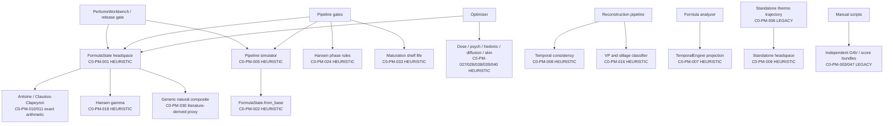

# Build C0 Physical-Model Inventory and Call Graph

Audit date: 2026-08-02
Machine authority: `docs/verification/c0/physical_model_inventory.json`
Repository baseline: `9e88f5d80ee6b1c001ff90b7e5ac6d125d60b871`

## Result boundary

This report describes the checked-out working tree. It does not promote a model,
measurement, or claim. The classifications are the exact C0 vocabulary. A helper
can contain exact arithmetic while its downstream claim remains heuristic because
its inputs, applicability, or calibration are weaker.

No current implementation qualifies as `EMPIRICALLY_CALIBRATED_MODEL`.

## Runtime call graph

The accepted future route is a single versioned `engine.physics` router. C0 does
not implement or activate it.

## Complete implementation index

| ID | Category | Implementation | Class | Current status | Consolidation decision |
|---|---|---|---|---|---|
| C0-PM-001 | formula-state headspace | `build_formula_state` | `HEURISTIC` | canonical compatibility runtime | keep until C4 adapter passes |
| C0-PM-002 | formula-state headspace | `FormulaState.from_base` | `HEURISTIC` | canonical temporal support | keep until C6 adapter passes |
| C0-PM-003 | formula-state headspace | standalone OAV script | `DISCONNECTED_LEGACY` | manual script | freeze/deprecate |
| C0-PM-004 | formula-state headspace | `SolventLedger` | `HEURISTIC` | canonical input adapter | replace with C2 matrix contract |
| C0-PM-005 | temporal | pipeline simulator | `HEURISTIC` | canonical compatibility runtime | keep until C6 |
| C0-PM-006 | temporal | standalone thermo trajectory | `DISCONNECTED_LEGACY` | no product caller | freeze/deprecate |
| C0-PM-007 | temporal | `TemporalEngine` projection | `HEURISTIC` | formula-analyzer runtime | block new callers; migrate explicitly |
| C0-PM-008 | temporal | reconstruction temporal consistency | `HEURISTIC` | reconstruction advisory | retain under advisory name |
| C0-PM-009 | thermo headspace | standalone modified-Raoult headspace | `HEURISTIC` | standalone library | possible internal C4 adapter only |
| C0-PM-010 | VP equation | Antoine branch | `EXACT_PHYSICAL_ARITHMETIC` | shared runtime | wrap with C1 range/convention contract |
| C0-PM-011 | VP equation | Clausius-Clapeyron branch | `EXACT_PHYSICAL_ARITHMETIC` | shared runtime | wrap with C1 applicability |
| C0-PM-012 | VP estimation | constant VP25 fallback | `HEURISTIC` | shared fallback | downgrade/withhold outside reference condition |
| C0-PM-013 | VP estimation | VP25-to-dHvap correlation | `LITERATURE_DERIVED_MODEL` | shared fallback | version source/domain/uncertainty |
| C0-PM-014 | VP estimation | synthetic Antoine coefficients | `HEURISTIC` | exported helper | do not promote |
| C0-PM-015 | VP estimation | SMILES group-feature estimator | `HEURISTIC` | enrichment advisory | non-canonical unless fully versioned |
| C0-PM-016 | VP/sillage | reconstruction classifier | `HEURISTIC` | reconstruction advisory | retain only as heuristic |
| C0-PM-017 | VP equation | DIPPR-style equation | `UNSUPPORTED` | absent | withhold |
| C0-PM-018 | activity coefficient | Hansen-distance gamma | `HEURISTIC` | canonical compatibility runtime | replace only after C3-C5 validation |
| C0-PM-019 | activity coefficient | fixed profile gamma branch | `HEURISTIC` | canonical fallback | make explicit or withhold |
| C0-PM-020 | activity coefficient | chemical-class estimator | `HEURISTIC` | enrichment advisory | non-canonical |
| C0-PM-021 | activity coefficient | optimizer logP rule | `HEURISTIC` | optimizer legacy runtime | migrate optimizer to router |
| C0-PM-022 | UNIFAC | capability boundary | `STUB` | explicitly inactive | remain inactive |
| C0-PM-023 | UNIFAC | group catalogue | `STUB` | data only | not algorithm activation |
| C0-PM-024 | Hansen/phase | RED and bloom rules | `HEURISTIC` | canonical advisory gate | retain as screening only |
| C0-PM-025 | Hansen/phase | pairwise HSP distance | `EXACT_PHYSICAL_ARITHMETIC` | advisory helper | input authority still bounds claim |
| C0-PM-026 | COSMO-RS | interface/import | `UNSUPPORTED` | absent | withhold |
| C0-PM-027 | dose response | character-zone Hill scorer | `HEURISTIC` | optimizer advisory | no receptor/sensory promotion |
| C0-PM-028 | psychophysics | suppression/adaptation scorer | `HEURISTIC` | optimizer advisory | require C9 evidence |
| C0-PM-029 | psychophysics | OAV target/cliff rules | `HEURISTIC` | canonical advisory | keep separate from measurements |
| C0-PM-030 | natural decomposition | generic constituent composite | `LITERATURE_DERIVED_MODEL` | canonical proxy | C7 adds lot authority |
| C0-PM-031 | natural decomposition | in-memory lot registry | `STUB` | disconnected | integrate only through C7 canonical lot path |
| C0-PM-032 | maturation | Arrhenius arithmetic | `EXACT_PHYSICAL_ARITHMETIC` | shared helper | parameter authority required |
| C0-PM-033 | maturation | reaction/shelf-life predictor | `HEURISTIC` | canonical advisory gate | relabel/withhold under C9 |
| C0-PM-034 | receptor | family-prior occupancy | `HEURISTIC` | quarantined | keep outside production |
| C0-PM-035 | receptor | glomerular transforms | `HEURISTIC` | quarantined | keep outside production |
| C0-PM-036 | adaptation | receptor adaptation state | `HEURISTIC` | quarantined | require C9 protocol evidence |
| C0-PM-037 | adaptation | material penalty | `HEURISTIC` | advisory helper | consolidate under C9 |
| C0-PM-038 | hedonic | fixed-valence scorer | `HEURISTIC` | optimizer advisory | require panel validation |
| C0-PM-039 | diffusion/sillage | Kaw/MW field scorer | `HEURISTIC` | optimizer advisory | never substitute for distance-time data |
| C0-PM-040 | skin/longevity | skin/fabric scorer | `HEURISTIC` | optimizer advisory | freeze duplicate accounting (>100% possible); separate partition from endpoint claims |
| C0-PM-041 | skin/release | Potts-Guy/depot helper | `LITERATURE_DERIVED_MODEL` | safety advisory | carry domain and fallback authority |
| C0-PM-042 | longevity | backend note-hour estimate | `HEURISTIC` | legacy helper | freeze/deprecate |
| C0-PM-043 | sillage | backend note-rule estimate | `HEURISTIC` | legacy helper | freeze/deprecate |
| C0-PM-044 | longevity/sillage/receptor | workbench abstention | `UNSUPPORTED` | canonical runtime | preserve `null`/`UNKNOWN` |
| C0-PM-045 | release scores | impact/tenacity/diffusion bundle | `HEURISTIC` | release advisory | keep separate from measurements |
| C0-PM-046 | calibration | in-sample linear correction | `HEURISTIC` | optional legacy | C5 must add held-out evaluation |
| C0-PM-047 | formula scoring | standalone formula simulator | `DISCONNECTED_LEGACY` | manual script | freeze/deprecate |
| C0-PM-048 | optimizer | composite physical/sensory scorer | `HEURISTIC` | optimizer runtime | C10 consumes router/gates |

## Unsupported and inactive capabilities

- DIPPR-style vapor-pressure equations: no executable Python implementation.
- COSMO-RS: no executable Python interface or import.
- UNIFAC: group data and capability reporting exist, but no active algorithm,
  complete subgroup/parameter assignment, or perfume-domain validation.
- calibrated equilibrium headspace: no current model has held-out measured
  headspace validation for its declared matrix/application domain.
- calibrated longevity, sillage, and receptor endpoints: canonical workbench
  correctly returns `null`/`UNKNOWN`.

## Claim-impact conclusions

1. FormulaState is the only current canonical compatibility path for headspace,
   but its `HEURISTIC_NOT_MEASURED` label remains binding.
2. Pipeline simulation is the only current canonical compatibility path for
   temporal frames, but it is not wear duration or calibrated dynamic release.
3. Reconstruction, optimizer, analyzer, backend, and script paths can still emit
   competing physical-sounding values. They are explicitly advisory or legacy.
4. Exact equation arithmetic never promotes uncertain coefficients, matrix,
   applicability, or unvalidated endpoint transfer.
5. Natural composite OAV is generic, not lot-specific and not regulatory
   composition.
6. The skin/fabric scorer's shared post-branch block duplicates known-material
   rows and mass. Frozen case `C0-LH-008` records duplicate reservoir rows and
   `reservoir_pct = 140.0`; this is a legacy defect, not scientific validation.
7. C0 changes no runtime. The ADR and fixtures make later migration auditable.
