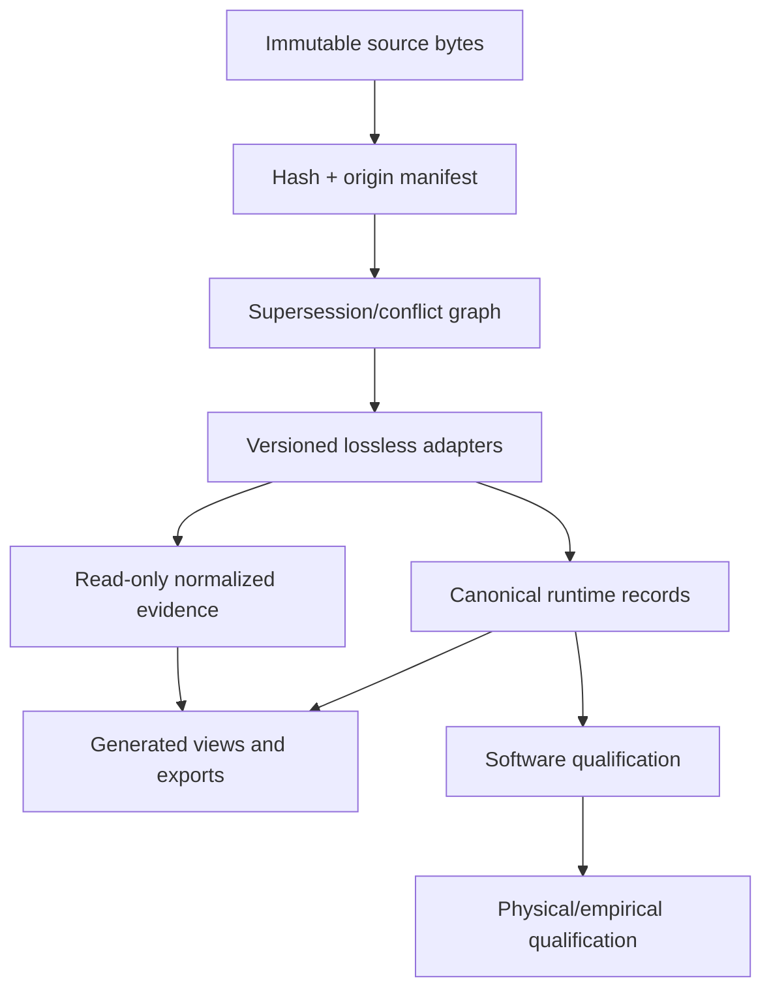

# Perfume-Chem Lossless Integration Control Report

**State:** `COLLECTION_PREPARED__LIVE_DISPATCH_BLOCKED_BY_SIGN_IN`  
**Cut:** 2026-08-09, Asia/Bangkok  
**Scope:** latest recoverable cross-chat state, 16 supplied artifacts, current repository candidate, and the controls required to install the full perfume-chem estate without silently losing information, behavior, provenance, uncertainty, or meaningful complexity.

This is an integration-control report, not a claim that every project chat has replied to the new request. The ChatGPT project UI is currently signed out: **0 of 75 provisional functional destinations have been messaged**. Exact chat titles and the final recipient count must be verified after sign-in. The request and response contract are ready for dispatch.

## Executive finding

There is no proven single, end-to-end integrator for the complete chat estate. The project instead contains several internally strong but scope-limited integrations: PCV3, ACCORD, XHIGH, canonical cutover, stock/quantity rebase, interaction/floral programs, and verification gates. Installing everything safely therefore requires a provenance-first federation of immutable source bytes, followed by explicit normalization adapters and one canonical runtime. A file copy, archive flattening, workbook import, or broad branch merge would be lossy and unsafe.

The latest recoverable state corrects two older conclusions:

1. Inventory V5 is no longer missing from the durable project estate. Exact reported identity: `Kenny_Current_Perfumery_Inventory_Master_Aug2026_v5.xlsx`, 199,635 bytes, SHA-256 `e36287aca26f34354b3244f07618cb4c12750dfb85db5584dca39d5130025331`. It is still not materialized as a hashed source snapshot in the GitHub candidate branch.
2. Exact source bytes for PCV3 Chat 1 Meaningful Complexity V3 and Chat 2 Experimental Data Model were recovered and ledger-verified. Recovery clears source-byte holds only; it does not establish runtime activation, physical execution, or release.

The repository candidate and the newest local/tunnel work are not the same state. The open draft PR head is `a7bacff3539bf5e60c94d1fbe48df3d0f1f90da3`; it lacks the reported local `pre_mix_guard.py`, its tests and integration, and it does not contain the authoritative V5 source snapshot. CI remains unproven at the exact intended integration head. Local success is not installable GitHub truth.

## Authority and preservation rules

Apply this precedence while retaining every predecessor as immutable provenance:

1. newest terminal completion, closure, freeze, remediation, or superseding receipt for the exact lane;
2. current Inventory V5 for availability and exact-stock resolution;
3. project protocol, current meaningful-complexity model, strict reverification, and hard negative-truth gates;
4. exact synchronized cross-brand and canonical-cutover artifacts;
5. research registries, interaction/floral/style/pilot architecture, and planning screens;
6. newest formula- or brand-specific workbook for that target;
7. historical and superseded artifacts.

Precedence never authorizes deletion. A superseded artifact stays preserved with an explicit edge to its successor. Unresolved contradictions remain `HOLD`; missing evidence remains `UNKNOWN` or `NOT_TESTED`.

The following separations are mandatory:

- ideal target identity and architecture;
- inventory-constrained build with exact stock, strength, solvent, lot/source, units, and basis;
- physical bottle/batch and its measurements;
- measured or source-verified evidence;
- modeled, inferred, hypothetical, screened, planned, and not-run states.

Inventory constrains the build and never rewrites the target. Planned Ambrettolide is design-available but physical-procurement pending. Notes are not molecules; material presence is not dose; modeled OAV/headspace/interaction is not perception, liking, safety, stability, manufacturing readiness, or release.

## Latest recovered estate state

| Lane | Latest recoverable state | What it proves | What remains held |
|---|---|---|---|
| Global estate | `NO_PROVEN_SINGLE_END_TO_END_CHAT_ESTATE_INTEGRATOR` | Scope-specific integration exists | Complete all-chat harvest, cross-lane conflict resolution, single canonical publication |
| PCV3 Chat 1 | Exact V3 package recovered; SHA-256 `10acff0eb8f9e40dc0bd0e8152e04eb3c6440393c39dc950ccc3e96dccc1f6e1`; 10/10 ledger | Exact source-byte integrity | Runtime activation, repository publication, physical claims |
| PCV3 Chat 2 | Exact package recovered; SHA-256 `db638ab82c7e1a798297a9f4376014b9f51965511ae1d65132e57b4d12c9c9eb`; 11/11 ledger | Exact source-byte integrity and current record-model source | Runtime activation, repository publication, physical claims |
| Canonical cutover | V2 package SHA-256 `e9e325bea9117dbe2a97ff67e77d57705a54244591278fac7a34915a7f0ae523`; 198 members | Canonical-cutover source package is retrievable | Original G15 wrapper provenance; repository cutover |
| G15 headspace/OAV | Functional patch is available and includes the permanent 10%-stock/10× negative regression | Software contract and regression source exist | Original wrapper provenance, stock-spec integration, exact-head CI, physical/empirical qualification |
| ACCORD structural/integration | Phase B reported closed with inherited source-byte/execution holds; 7/7 V2 ZIPs passed CRC and member checks | Structural and content reconciliation within ACCORD | Cross-estate publication, physical execution, remaining inherited holds |
| ACCORD Chat 8 | Reported read-only complete: 228 combinations, 202 techniques, 161 designed screens | Planning and experiment-design coverage | Zero physical results; no formula/runtime mutation authorized |
| XHIGH A–K | Scientific freeze: A, B, C, D v1.1, E, F, G, H post-replay, I, J; worker tests 285/285 and K 14/14 | Frozen scientific package and internal tests | Host runtime installation, publication, exact-head CI, independent release review |
| XHIGH RC5 | Candidate reports 46/46 tests and 15/15 static/security checks; repository mutations 0 | Local remediation candidate quality | Branch publication, actual host, CI, rollback exercise, fresh PRO acceptance |
| Interaction replay | 253 pairs: 184 `HOLD`, 69 `NARROW`, 0 validation upgrades | Conservative replay preserved evidence boundaries | Physical interaction evidence and calibration |
| Floral | FC0 complete, FC1 pass, FC2 external evaluator operational, FC3 seeded | Architecture/evidence program state | FC5/FC6 canonical integration, physical bridge, target-specific evidence, source package recovery |
| Six-pilot | 18 immutable pre-screen architecture branches, 15 interfaces, 12 future concepts, 227 designs, 2,724 blank evaluation rows | Architecture and preregistered evaluation design | 0 physical results; formulas/hashes outside workbook; 8 label locks |
| Qualification V1 | Archive integrity valid; reproducible reference result `FAIL`, 15/16; target engine `NOT RUN` | Reference harness behavior and one defect are reproducible | Correct regeneration, adapter, target-engine execution, empirical qualification |
| Inventory | V5 exact bytes/hashing reported current; 207 ingredients | Current availability authority can be snapshotted | GitHub source snapshot, normalized record set, complete ExactStockRef binding |
| Repository | Draft PR #1 head `a7bacff…`; master `00bbc816…` | Broad candidate code exists | Reviewable bounded branch, exact integration head, CI, host qualification |

Numbers originating in prior chat reports are retained as `REPORTED_CROSS_CHAT` until the originating chat returns an exact terminal report and artifact ledger under the new response contract.

## Supplied artifact audit

### Byte integrity and collisions

All supplied ZIPs pass archive integrity checks. Two packages have internally matching declared SHA manifests, but their meaning and coverage differ:

- Meaningful Complexity V2 pack: 7 members; governance/schema scaffolding only; no external-model run, formula outputs, gate results, ablations, or perturbation runs.
- Interaction Atlas V1 package: 23 members; the internal SHA manifest covers only 7 core outputs. It excludes the README, package manifest, template, and 12 worker packets. Preserve the original partial manifest and add a separate complete extraction manifest.
- Qualification V1 package: 18 members; all 17 files named in its SHA manifest verify. Two compiled `__pycache__` files should be retained in the immutable source package but not installed as repository runtime files.

Top-level files 02, 03, and 09 are exact duplicates of members in the Meaningful Complexity archive. Files 06, 07, 10, 11, and 12 are exact duplicates of members in the Atlas archive. Deduplicate by content address and provenance relationship, not by deleting one origin. Both packages contain generic `README.md` and `SHA256SUMS.json`; flattening them into one directory would overwrite provenance.

### Three incompatible interaction contracts

The supplied files contain three distinct interaction models:

| Contract | Core fields | Status |
|---|---|---|
| Generic interaction schema | `source_group`, `target_group`, `effect_type`, `direction` | Not the schema for the Atlas JSON |
| Meaningful Complexity embedded record | `source_system`, `target_system`, `effect_type` | Formula-audit context |
| Atlas V1 | `group_a_id`, `group_b_id`, bidirectional prose | Complete 23-group/253-pair topology |

Applying the generic schema to Atlas V1 produces 1,035 missing-required-field errors. Keep each raw schema namespaced by schema family and version, register stable internal aliases, and implement explicit adapters. Do not rename raw fields in place. The Atlas stores several logical arrays as semicolon-delimited strings; parsers must retain the raw text alongside normalized arrays so byte and semantic round trips remain possible.

### Interaction Atlas V1 boundary

Atlas topology is complete: 23 unique groups and all 253 unordered pairs, with no orphan, duplicate, self, missing, or extra pairs. JSON and CSV have zero mismatches across all 253 rows and 19 fields; the group register also reconciles.

Scientific coverage is not complete:

- 68 rows are evidence-enriched;
- 185 rows are structured hypothesis templates;
- 55 are Kenny-priority pairs, of which 26 remain structured hypotheses;
- measured headspace: 0;
- strict empirical OAV: 0;
- physical pair passes: 0;
- style case studies: 0;
- empirical releases: 0.

The 125 resolved inventory examples were checked against Inventory V3, not current V5. Preserve the V3 claims unchanged and generate a V5 overlay; never rewrite the raw Atlas. Its workbook is a static view with zero formulas, not a recalculating source of truth.

### Floral and six-pilot boundary

The floral task ledger has 15 rows: 11 `COMPLETE`, 1 `HOLD`, 2 `BLOCKED`, and 1 `CONDITIONAL`. Every row explicitly records `formula_mutation=False`, `repository_mutation=False`, `physical_result=False`, and `phase_g_authorized=False`. Preserve those fields; `COMPLETE` means artifact construction within that task, not physical or canonical completion.

The floral workbook contains 294 family-slot role records. All 294 require target-specific evidence, are `NOT_CALIBRATED`, and have physical state `NOT_RUN`. It also contains 12 ambiguous alias holds, 19 blank active-fraction/product-basis fields, and 23 product-basis rows. Its 20-source registry is general botanical/volatile evidence; all 9 family gaps report zero target-specific sources, measured dose-response, physical results, strict OAV, and safety releases. The workbook mirrors missing external configs, data, evaluator code, tests, and receipts and is not sufficient executable source.

The six-pilot workbook contains architecture and prescreen logic, not formulas or measurements. All 18 drafts are immutable pre-screen records; all temporal handoffs are `NOT RUN`; all 15 interfaces require physical testing and contain no formula; 12 future designs are concept-only. Upstream source fragments and immutable formula hashes must be harvested rather than inferred from anchor text.

### Qualification V1 contradiction

The package's manifest, result files, and README say `FAIL`; the workbook Dashboard says `REFERENCE HARNESS PASS`, and its release sheet labels 15/16 as PASS. Re-running the supplied script reproduces exit code 1: EQ-02 expects G14, but the fixture quality score 98 correctly causes the checker to emit G1–G13 only. The target engine was not run.

Quarantine this package as a failing legacy fixture. Decide the intended EQ-02 semantics and regenerate every result, workbook, hash, and manifest together. Do not install its CSV/JSON as a passing golden baseline. Retain G1 product-basis integrity, G2 arithmetic/executable dosing, and G13 measured-headspace/strict-OAV claim integrity as valuable negative-truth concepts; treat uncalibrated thresholds and booleans as versioned diagnostic hypotheses.

## Source SHA-256 ledger

| ID | Supplied artifact | Bytes | SHA-256 |
|---:|---|---:|---|
| 01 | `PROTOCOL.md` | 59,246 | `f192fdea259052d445f39f2264b1907e92e1139ee8ddf112f57d2a7a99558961` |
| 02 | `meaningful_complexity_schema.json` | 10,052 | `d0117d31e2f9e5383b92ddc21c71d44d5e4935a8ab431055e0b85ca20c75ee8a` |
| 03 | `Meaningful_Complexity_Audit_v2.md` | 15,302 | `07d84574365abb6a8e505fdcaf4e496ee1ac1d90f1397053d41f20b0a9394ff3` |
| 04 | `Perfume_Meaningful_Complexity_Audit_v2_Pack.zip` | 11,951 | `76c98fa8d5b92e7c0be252d83356d49dd662ad69c9ab79f377dc386a6d3e2178` |
| 05 | `PERFUME_CHEM_LITERATURE_VERIFICATION_LEDGER.md` | 27,155 | `4f2206893d6f8d682aa6df798a3a5c8c9b2a815b8ed2c4025c20cd108544b9e7` |
| 06 | `Perfumery_Interaction_Layering_Atlas_v1.md` | 2,603 | `d059bc75bf4d8bcb4bc6329c4a7302960262a522f0a6964919acd736f898c54d` |
| 07 | `Perfumery_Interaction_Layering_Atlas_v1.xlsx` | 120,053 | `f5e381ee4a338784ed9c25a5058b9a5ef6567423e72cec8c799952d4ed38f468` |
| 08 | `Perfumery_Interaction_Layering_Atlas_v1_Package.zip` | 679,235 | `d9d3b55cb37f6dbcb0f2f9317162afdebe9ce2ff8092647d2fbdfd5042b11e6f` |
| 09 | `interaction_matrix_schema.json` | 2,436 | `8b59ea375c677121aaeb9341cfbdf691d8c08fa8f7a2e28d35c1bc0be3c2bea7` |
| 10 | `Perfumery_Interaction_Layering_Atlas_v1.schema.json` | 1,303 | `e1532e660852157dd300e63fe26f829de0de2f1a7e353d9358c28b3ae054f0bf` |
| 11 | `Perfumery_Interaction_Layering_Atlas_v1.json` | 353,650 | `321766b1892d6e684474aece142991d588a8719d0d7f5626e4cbf3254a3a5e90` |
| 12 | `Perfumery_Interaction_Layering_Atlas_v1.csv` | 206,739 | `8aa314e810f2c98e3d6a3c1da45b0741bc9587df355c41e323d43c8396ab213e` |
| 13 | `FLORAL_COVERAGE_FC2_FC3_TASK_LEDGER.csv` | 2,044 | `196626b9fdf7ec53e04dba35433b6332c0db257057ae0c38bb618e93a8ccc861` |
| 14 | `FLORAL_COVERAGE_FOUNDATION_v2.xlsx` | 84,890 | `5d04a47a5663a79e334eb96c44c3515cdc6cfee0d78761de76e9bef9f5e5ee6d` |
| 15 | `SIX_PILOT_PERFUME_ARCHITECTURE_LATTICE_v1.xlsx` | 38,874 | `2b5c2bff9d8b26c50d481442f87ea6cee0d9c4f0e46578b14c4137f1b75659e3` |
| 16 | `Perfume_Verification_Engine_Qualification_v1_Package(1).zip` | 371,891 | `af2b207bda605058472c868d94f907ea1b6540a8baf1a6458472a55193f7f07d` |

License and creator metadata are absent from the two source packages inspected in detail. Local integration is feasible, but external redistribution authority remains `UNKNOWN` until provenance supplies those rights.

## Lossless canonical architecture

The source layer is federated because distinct chat artifacts and schema families must retain their own bytes and meanings. The runtime is singular: normalized code and data may have only one canonical writable owner. Markdown, CSV, XLSX, previews, dashboards, and summaries are generated projections unless an artifact is explicitly preserved as source evidence.

## Dependency-ordered installation plan

### Phase 0 — Freeze and inventory

1. Create a bounded child branch from the explicitly approved base; do not merge the broad draft PR as an implicit audit decision.
2. Record exact base, branch, environment, toolchain, and lockfile hashes.
3. Harvest terminal reports and exact artifacts from every verified chat destination using the prepared request/schema.
4. Assign each byte object a content ID, origin ID, lane, author/time, retrieval receipt, classification, and legal/provenance status.
5. Generate a complete member manifest for every archive while retaining original manifests unchanged.

Acceptance: every claimed terminal artifact is retrievable by hash or has an explicit source-byte `HOLD`; no chat is marked collected on prose alone.

### Phase 1 — Immutable provenance vault

Land original bytes under a content-addressed, origin-preserving layout such as:

- `evidence/imports/<lane>/<artifact-id>/<sha256>/original/...`
- `evidence/imports/<lane>/<artifact-id>/<sha256>/origin.json`
- `evidence/imports/<lane>/<artifact-id>/<sha256>/complete_manifest.json`

Store duplicate relationships instead of duplicating or deleting semantic origins. Never flatten packages. Never edit a raw JSON, workbook, CSV, schema, patch, or report to make it current.

Acceptance: byte-for-byte re-export and archive-member reconstruction pass; all supplied hashes above verify.

### Phase 2 — Supersession and conflict registry

Implement an append-only graph with stable artifact/message IDs and typed edges: `SUPERSEDES`, `DERIVED_FROM`, `DUPLICATES_BYTES_OF`, `CONFLICTS_WITH`, `NORMALIZES`, `GENERATES`, `REQUIRES`, and `BLOCKED_BY`. Retain original verbatim states plus normalized states; do not destructively coerce `REVISE`, `STOCK HOLD`, `FORMULATION HOLD`, and `EVIDENCE HOLD` into one generic enum.

Acceptance: old “V5 missing” and “MCv3/Chat2 bytes missing” reports remain queryable but are visibly superseded by the current receipts; no unresolved conflict is silently selected as truth.

### Phase 3 — Inventory V5 and exact-stock boundary

1. Land the exact V5 workbook as an immutable source with the reported size/hash.
2. Produce a normalized snapshot with stable material and stock IDs, aliases, concentration, basis, solvent, source/lot, availability, planned/procurement state, and parent hashes.
3. Define independent `TargetIdentity`, `BuildMaterial`, `ExactStockRef`, `FormulaBuild`, `PhysicalBatch`, `CodedSample`, and measurement records.
4. Rebase V3/V4 inventory claims through overlays and crosswalks. Preserve original match/status fields.
5. Fail closed on ambiguous aliases, unknown active fraction, product-basis ambiguity, density-required conversion, missing exact stock, and implicit neat/1.0 defaults.

Acceptance: the target graph is unchanged by inventory availability; planned Ambrettolide remains design-available/procurement-pending; every executable build row resolves an exact stock and basis.

### Phase 4 — Versioned adapters, not schema collapse

Implement dedicated parsers and semantic validators:

- PCV3 Meaningful Complexity V3 current adapter;
- Meaningful Complexity V2 legacy adapter with raw-state round trip;
- PCV3 experimental model adapter preserving `physicalBatch` and `componentAddition` distinctions;
- Interaction Atlas V1 parser and semantic validator;
- generic interaction-matrix adapter as a separate schema family;
- floral V2 adapter after the missing external machine-source package is recovered;
- six-pilot architecture adapter that imports no absent formulas;
- qualification V1 quarantine adapter that preserves `FAIL` and workbook contradiction;
- XHIGH frozen package read-only adapter under a feature flag;
- G15/headspace-OAV patch adapter after exact source and stock-spec reconciliation.

For Atlas V1, require stable group/source/packet IDs, exact C(n,2) pair coverage, ordered/no-self pairs, foreign-key resolution, evidence/status invariants, source URL expansion, bounded confidence, nonempty physical tests, JSON/CSV parity, group-register parity, and manifest reconciliation.

Acceptance: raw-to-normalized-to-raw semantic round trips preserve every original value; no adapter upgrades evidence or execution state.

### Phase 5 — Runtime hardening

1. Install the hard pre-mix guard and its negative-truth fixtures from exact reviewed source; wire it into the release gate path.
2. Make interaction loading fail closed for unknown schema versions, invalid hashes, broken FKs, duplicate/incomplete pairs, unsupported evidence states, and inventory snapshot mismatch.
3. Patch G15/OAV authority to consume resolved `stock_specs`; remove unjustified `1.0`/neat fallbacks.
4. Keep headspace/OAV levels explicit: dose accounting, equilibrium screen, finite-dose model, substrate model, calibrated model, and measured evidence are separate tiers.
5. Keep external XHIGH tables/views append-only and the host adapter read-only/feature-flagged until actual-host qualification.

Acceptance: the permanent Prada regression fails a 10% stock treated as neat by exactly the expected 10× discrepancy and passes equivalent active dose representations; no release path can bypass stock/basis/unit gates.

### Phase 6 — Qualification and cutover

1. Run source integrity, schema self-check, semantic, FK, unit, arithmetic, property, mutation, migration, round-trip, regression, and derived-view drift tests.
2. Regenerate Qualification V2 from independently computed fixtures. Record input, inventory, engine, environment, seed, and output hashes.
3. Run exact-head CI on the bounded branch.
4. Install in read-only shadow mode; compare canonical outputs and failure states against source artifacts.
5. Exercise rollback and verify source-byte re-export.
6. Obtain actual-host qualification and fresh independent review.
7. Run physical/empirical programs separately. Promote only measured, sourceable results through the claim ledger.

Acceptance: software qualification cannot emit similarity, liking, safety, stability, measured headspace, strict empirical OAV, physical PASS, manufacturing readiness, or release without the corresponding empirical evidence.

## Canonical destination map

| Source class | Canonical treatment |
|---|---|
| Protocol and governance | Versioned docs and executable invariant tests; retain verbatim source |
| Inventory V5 | Immutable source workbook + hashed normalized snapshot + exact-stock records |
| PCV3 exact packages | Immutable source + current versioned adapters; inactive until tests and publication pass |
| MC V2 package | Legacy ancestry only; no current-runtime import without a proven V2→V3 adapter |
| Interaction Atlas V1 | Raw JSON canonical within its source family; CSV/XLSX/MD as projections; V5 overlay separate |
| Floral V2 | Architecture/evidence snapshot now; executable import held until external package/receipts are recovered |
| Six-pilot lattice | Identity/architecture/preregistration records only; absent formulas must not be reconstructed |
| Qualification V1 | Quarantined failing fixture with explicit 15/16 receipt |
| G15 patch | Reviewed source patch and regression tests; activate only after stock-spec and provenance closure |
| XHIGH frozen release | Read-only, feature-flagged integration; no canonical writes before host/PRO acceptance |
| Local pre-mix guard | Source recovery and bounded publication required; local-only code is not canonical |
| Reports/workbooks/dashboards | Generated views unless explicitly classified as immutable evidence |

## Mandatory test and acceptance matrix

| Gate | Required proof | Fail behavior |
|---|---|---|
| Source integrity | Outer hash, complete member manifest, original-manifest reconciliation | `HOLD_SOURCE_BYTES` |
| Supersession | Terminal/current selection plus preserved predecessor/conflict graph | `HOLD_AUTHORITY_CONFLICT` |
| Inventory | V5 source hash and full exact-stock resolution | `HOLD_STOCK` |
| Units/basis | Exact decimal active-equivalent and mass balance; density when required | `FAIL_PRE_MIX` |
| Schema | Draft/version identity, strict fields, enums, FKs, uniqueness, completeness | `FAIL_SCHEMA` |
| Semantic round trip | Raw value/state retained through normalize/export | `FAIL_LOSSLESSNESS` |
| Interaction evidence | Evidence class preserved; no hypothesis→fact promotion | `FAIL_EVIDENCE_PROMOTION` |
| Formula separation | Target, build, physical batch, coded sample, and measurement distinct | `FAIL_OBJECT_COLLAPSE` |
| Engine qualification | Independently computed fixtures against exact engine head | `FAIL_QUALIFICATION` |
| CI | Exact integration commit and lockfile/environment receipt | `HOLD_CI` |
| Runtime | Read-only shadow comparison, host exercise, rollback | `HOLD_HOST` |
| Physical claims | Sourceable experiment, instrument/panel method, result and uncertainty | `HOLD_EMPIRICAL` |

## Current blockers requiring chat replies

1. Exact chat inventory and terminal titles cannot be verified until the ChatGPT project is signed in.
2. The original G15 wrapper remains a provenance hold, although its functional patch is available.
3. Floral executable configs/data/evaluator/tests/receipts referenced by the workbook are not in the supplied files.
4. Six-pilot immutable formula artifacts/hashes are outside the supplied workbook.
5. The exact repository publication state of local/tunnel additions is unresolved; `pre_mix_guard.py` is absent from the known PR head.
   Multiple cross-chat summaries report different local hashes for the guard and its tests. Preserve every reported identity as conflicting provenance until exact bytes and a superseding receipt identify the current version.
6. XHIGH RC5 has no published bounded branch, exact-head CI, actual-host run, rollback receipt, or fresh PRO acceptance.
7. Qualification V1 contradicts itself and has never run the target engine.
8. Atlas V3 inventory locks must be rebased through a V5 overlay; 185 interaction rows remain structured hypotheses.
9. All physical, measured-headspace, strict-OAV, safety, stability, similarity, liking, manufacturing, and release claims remain outside software-only evidence.

## Dispatch and reconciliation controls

The collector will use:

- `PERFUME_CHEM_ALL_CHAT_REPORT_REQUEST_2026-08-09.md` as the unchanged request;
- `perfume_chem_chat_report.schema.json` as the machine response contract;
- `PERFUME_CHEM_CHAT_COLLECTION_LEDGER_2026-08-09.csv` as the provisional destination and completion ledger.

After sign-in, the collector must first enumerate the actual project chat list and reconcile it to the 75 provisional functional destinations. These are discovery controls, not an assertion that 75 separate conversations exist. It must add unrecognized chats, split multi-scope conversations where needed, merge only proven duplicate identities, and never assume that a functional lane name equals a UI chat title. Before sending, it must obtain action-time confirmation of the exact destinations and message content. After replies arrive, each report must pass schema, artifact-retrievability, hash/manifest, supersession, dependency, claim-state, and no-loss checks before its ledger row can move to collected.

## Final decision

The estate is **recoverable but not ready for a one-step installation**. The safe path is a reversible, provenance-first cutover with explicit adapters and conservative gates. Current exact packages, V5, the Atlas, floral and pilot architecture, G15 source, XHIGH freeze, and local remediation work can all be preserved without collapsing their scientific status—but several of them must remain inactive or quarantined until publication, source-byte, CI, host, or empirical holds are closed.

No repository mutation, formula mutation, physical-result mutation, or release promotion is authorized by this report.
