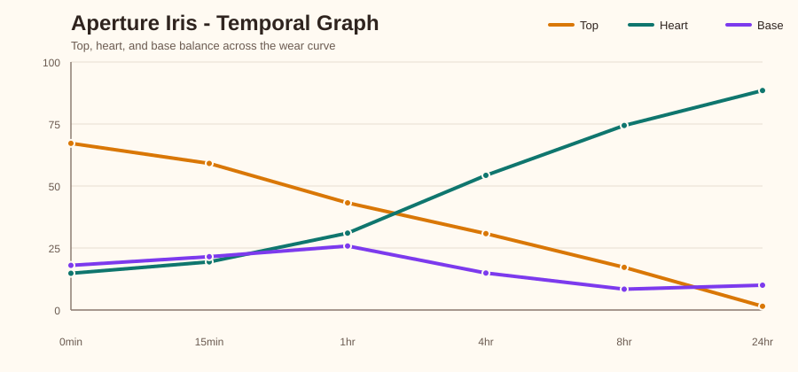
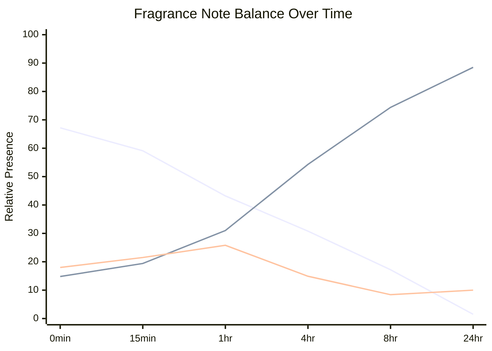

# Temporal Graph - Aperture Iris

### Temporal Graph

- Plain-English wear map for the formula over time.

#### At a Glance
- Starts as: top-led.
- Ends as: heart-led.
- Main handoff: top -> heart at 4hr.
- Early flash materials: Linalool, Rose Oxide.
- Mid-phase support: Bergamot FCF oil Sicilian, Ambrox Super (30% w/v, 3 g in 10 mL).
- Late drydown carriers: Opus V Iris Crystal, Hedione, Iso E Super.

#### Visual Time Series
- `Line 1 = Top`, `Line 2 = Heart`, `Line 3 = Base`.

#### Note Transitions
- top -> heart at 4hr

#### Wear Map
| Time | What Happens | Main Drivers | Balance |
|---|---|---|---|
| 0min | Bright opening. The top is clearly in charge. | Linalool, Ambrox Super (30% w/v, 3 g in 10 mL), Bergamot FCF oil Sicilian | T 67 / H 15 / B 18 |
| 15min | Still opening-led, but the heart is already rising. | Linalool, Ambrox Super (30% w/v, 3 g in 10 mL), Bergamot FCF oil Sicilian | T 59 / H 19 / B 22 |
| 1hr | The opening is fading and the heart is about to take over. | Opus V Iris Crystal, Ambrox Super (30% w/v, 3 g in 10 mL), Bergamot FCF oil Sicilian | T 43 / H 31 / B 26 |
| 4hr | This is the handoff point where the heart takes control. | Opus V Iris Crystal, Bergamot FCF oil Sicilian, Ambrox Super (30% w/v, 3 g in 10 mL) | T 31 / H 54 / B 15 |
| 8hr | The heart fully owns the perfume now. | Opus V Iris Crystal, Hedione, Bergamot FCF oil Sicilian | T 17 / H 74 / B 8 |
| 24hr | The heart fully owns the perfume now. | Opus V Iris Crystal, Hedione, Iso E Super | T 2 / H 88 / B 10 |

#### Technical Note Balance
| Time | Top | Heart | Base | Dominant |
|---|---:|---:|---:|---|
| 0min | 67.2 | 14.8 | 18.0 | top |
| 15min | 59.1 | 19.4 | 21.5 | top |
| 1hr | 43.2 | 31.0 | 25.8 | top |
| 4hr | 30.8 | 54.3 | 14.9 | heart |
| 8hr | 17.2 | 74.4 | 8.4 | heart |
| 24hr | 1.5 | 88.5 | 10.0 | heart |

#### Main Materials Over Time
| Material | Role In Wear | Fades By |
|---|---|---|
| Opus V Iris Crystal | late drydown carrier | >24hr |
| Linalool | opening material | 4hr |
| Bergamot FCF oil Sicilian | middle-to-late support | 24hr |
| Ambrox Super (30% w/v, 3 g in 10 mL) | middle-to-late support | 8hr |
| Hedione | late drydown carrier | >24hr |
| Cedrat FCF oil Sicilian | supporting material | - |
| Iso E Super | late drydown carrier | >24hr |
| Rose Oxide | opening material | 15min |

