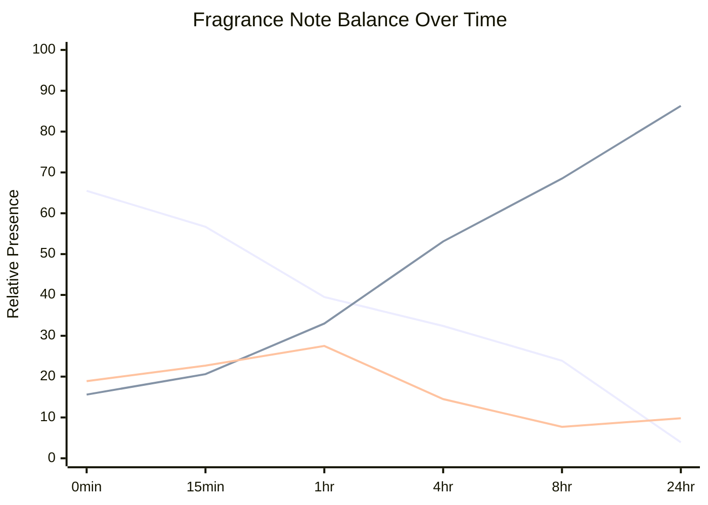

# Temporal Graph - Aperture Iris

### Temporal Graph

- Plain-English wear map for the formula over time.

#### At a Glance
- Starts as: top-led.
- Ends as: heart-led.
- Main handoff: top -> heart at 4hr.
- Early flash materials: Linalool.
- Mid-phase support: Ambrox Super (30% w/v, 3 g in 10 mL), Bergamot FCF oil Sicilian.
- Late drydown carriers: Opus V Iris Crystal, Hedione, Iso E Super.

#### Visual Time Series
- `Line 1 = Top`, `Line 2 = Heart`, `Line 3 = Base`.

#### Note Transitions
- top -> heart at 4hr

#### Wear Map
| Time | What Happens | Main Drivers | Balance |
|---|---|---|---|
| 0min | Bright opening. The top is clearly in charge. | Linalool, Ambrox Super (30% w/v, 3 g in 10 mL), Opus V Iris Crystal | T 66 / H 16 / B 19 |
| 15min | Still opening-led, but the heart is already rising. | Linalool, Ambrox Super (30% w/v, 3 g in 10 mL), Opus V Iris Crystal | T 57 / H 21 / B 23 |
| 1hr | The opening is fading and the heart is about to take over. | Opus V Iris Crystal, Ambrox Super (30% w/v, 3 g in 10 mL), Bergamot FCF oil Sicilian | T 40 / H 33 / B 28 |
| 4hr | This is the handoff point where the heart takes control. | Opus V Iris Crystal, Bergamot FCF oil Sicilian, Ambrox Super (30% w/v, 3 g in 10 mL) | T 32 / H 53 / B 14 |
| 8hr | This is the handoff point where the heart takes control. | Opus V Iris Crystal, Bergamot FCF oil Sicilian, Hedione | T 24 / H 68 / B 8 |
| 24hr | The heart fully owns the perfume now. | Opus V Iris Crystal, Hedione, Iso E Super | T 4 / H 86 / B 10 |

#### Technical Note Balance
| Time | Top | Heart | Base | Dominant |
|---|---:|---:|---:|---|
| 0min | 65.5 | 15.6 | 18.9 | top |
| 15min | 56.7 | 20.6 | 22.7 | top |
| 1hr | 39.5 | 33.0 | 27.5 | top |
| 4hr | 32.4 | 53.1 | 14.5 | heart |
| 8hr | 23.9 | 68.5 | 7.7 | heart |
| 24hr | 3.9 | 86.3 | 9.8 | heart |

#### Main Materials Over Time
| Material | Role In Wear | Fades By |
|---|---|---|
| Opus V Iris Crystal | late drydown carrier | >24hr |
| Linalool | opening material | 4hr |
| Ambrox Super (30% w/v, 3 g in 10 mL) | middle-to-late support | 8hr |
| Bergamot FCF oil Sicilian | middle-to-late support | 24hr |
| Hedione | late drydown carrier | >24hr |
| Cedrat FCF oil Sicilian | supporting material | - |
| Iso E Super | late drydown carrier | >24hr |
| Rose Oxide | supporting material | 1hr |

